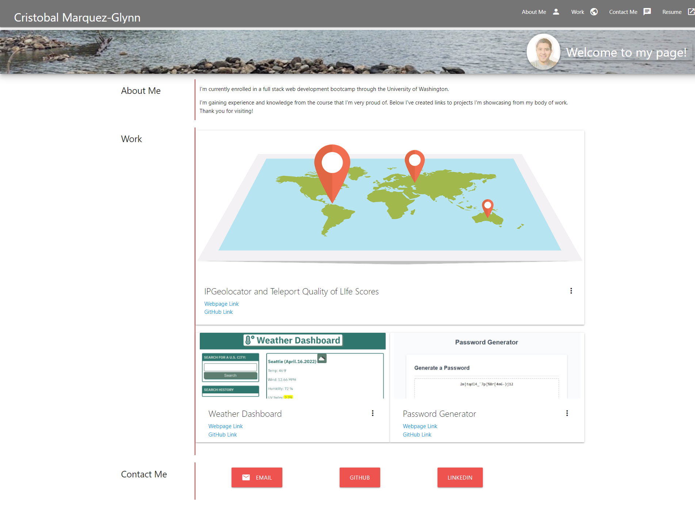
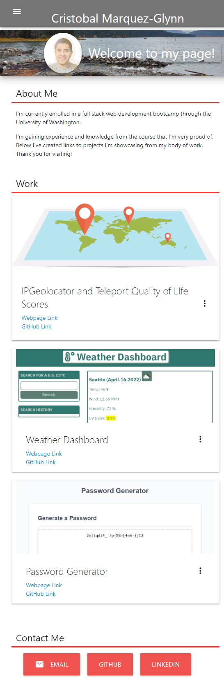

# Marquez-Glynn-Portfolio

## Description
- This week's homework assignment was to update our Portfolio page from week two. 
- I chose to use Materialize CSS framework to rebuild my Portfolio page to expand my knowledge CSS frameworks.
- My updated Portfolio page showcases my most recent group project and two strong homework assignments I submitted so far. 

The following are screenshots of the final version of the webpage when it was first submitted for review. The first screenshot is of the page as seen on a full desktop display. The Second screenshot shows page as it would appear in a smaller screen size device.

  
  

## Credits
For this homework assignment, I applied what was has been taught in the eight weeks of class and used the following webpages as resources to bring the project together, especially the Materialize CSS framework documentation 

- [Materialize CSS Framework](https://materializecss.com/) 

## License
MIT License

Copyright (c) [2022] [Cristobal Marquez-Glynn]

Permission is hereby granted, free of charge, to any person obtaining a copy
of this software and associated documentation files (the "Software"), to deal
in the Software without restriction, including without limitation the rights
to use, copy, modify, merge, publish, distribute, sublicense, and/or sell
copies of the Software, and to permit persons to whom the Software is
furnished to do so, subject to the following conditions:

The above copyright notice and this permission notice shall be included in all
copies or substantial portions of the Software.

THE SOFTWARE IS PROVIDED "AS IS", WITHOUT WARRANTY OF ANY KIND, EXPRESS OR
IMPLIED, INCLUDING BUT NOT LIMITED TO THE WARRANTIES OF MERCHANTABILITY,
FITNESS FOR A PARTICULAR PURPOSE AND NONINFRINGEMENT. IN NO EVENT SHALL THE
AUTHORS OR COPYRIGHT HOLDERS BE LIABLE FOR ANY CLAIM, DAMAGES OR OTHER
LIABILITY, WHETHER IN AN ACTION OF CONTRACT, TORT OR OTHERWISE, ARISING FROM,
OUT OF OR IN CONNECTION WITH THE SOFTWARE OR THE USE OR OTHER DEALINGS IN THE
SOFTWARE.

## Badges
Coming Soon

## How to Contribute
Please feel free to review my code at [GITHUB](https://github.com/CM-GDev/Marquez-Glynn-Porfolio) for this project and make any suggestions for improvements.

Here are the live webpage links for my Portfolio from week two, only using vanilla HTML and CSS [link](https://github.com/CM-GDev/Portfolio) and the link to my latest Portfolio page using Materialize CSS frame work [link](https://cm-gdev.github.io/Marquez-Glynn-Porfolio/)
 